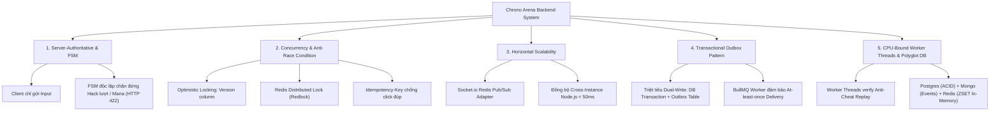

# 🏛️ BER-ARENA - BẢN THIẾT KẾ KIẾN TRÚC & TẦM NHÌN KỸ THUẬT (TECHNICAL VISION & CORE PILLARS)

> **Mục tiêu cốt lõi**: Ber-Arena không đơn thuần là một trò chơi giải trí, mà là một **hệ thống kiểm chuẩn năng lực Backend chuyên sâu (Enterprise Benchmark Platform)**. Dự án dùng bài toán Game chiến thuật thời gian thực và Sàn đấu giá triệu đô làm ngữ cảnh thực tế để giải quyết triệt để 5 bài toán hóc búa nhất trong kỹ thuật phần mềm phân tán.

---

## 🎮 1. QUY CÁCH SẢN PHẨM & LUẬT CHƠI (PRODUCT SPECIFICATIONS)

### 1.1. Bàn cờ & Luật chiến đấu
- **Bàn cờ**: Ô lưới kích thước **$4 \times 5$** (4 cột, 5 hàng).
- **Chỉ số người chơi**:
  - Máu (HP): **20 HP**. HP giảm về $\le 0 \rightarrow$ Thua cuộc lập tức.
  - Năng lượng (Mana): Tăng dần mỗi lượt (Lượt 1: 1 Mana, Lượt 2: 2 Mana, ..., tối đa 10 Mana).
- **Hệ thống quân bài & phép thuật**:
  - **Lính (Units)**:
    - *Chiến binh (Warrior)*: Cận chiến, máu trung bình, sát thương ổn định.
    - *Cung thủ (Archer)*: Tầm xa, máu giấy, bắn xuyên hàng.
    - *Hộ vệ (Guardian)*: Phòng thủ cao, khiên chắn bảo vệ nhà chính.
    - *Cơ chế lính*: Tự động tịnh tiến về phía trước và tấn công đối phương khi kết thúc lượt. Nếu lính chạm đáy sân đối diện sẽ gây sát thương trực tiếp vào HP người chơi.
  - **Phép (Spells)**:
    - *Hỏa cầu (Fireball)*: Gây sát thương diện rộng tức thì.
    - *Mưa thiên thạch (Meteor Shower)*: Sát thương hủy diệt trên hàng ngang.
- **Thời gian thực (Real-time)**:
  - Giới hạn lượt đánh: **30 giây / lượt**. Quá thời gian $\rightarrow$ Tự động chuyển lượt (Timeout).
  - Ngắt kết nối tạm thời: Giữ phiên **60 giây**. Kết nối lại trước 60s $\rightarrow$ Phục hồi nguyên trạng thái bàn cờ. Sau 60s $\rightarrow$ Xử thua vì bỏ cuộc (`SURRENDER`).

### 1.2. Hệ sinh thái ngoài trận đấu
- **Hàng đợi ghép trận (Matchmaking)**: Tìm kiếm đối thủ theo chỉ số ELO tương đồng bằng Redis Sorted Set, tự động nới rộng khoảng ELO theo thời gian chờ.
- **Chợ đấu giá (Auction House)**: Sàn niêm yết thẻ bài hiếm. Cơ chế đấu giá công khai cạnh tranh trực tiếp, hoàn tiền người bị vượt giá tức thì, chống bắn tỉa (Anti-Sniping).
- **Tài chính & Ví (Wallet)**: Cấp sẵn **1.000 Vàng** khi đăng ký. Mọi giao dịch nạp/trừ tiền bảo đảm tính toàn vẹn (ACID), không bao giờ âm ví.
- **Bang hội (Guild)**: 
  - Quản lý thành viên và quỹ bang hội theo mô hình Multi-tenancy RLS cách ly dữ liệu tuyệt đối.
  - **Quy tắc chống trục lợi (Anti-Abuse)**:
    - *Rời bang*: Bị phạt hồi chiêu **24 giờ** mới được phép xin vào bang mới (`guildLeftAt`).
    - *Gia nhập bang*: Trải qua thời gian tập sự **12 giờ** mới được mở khóa các đặc quyền tài chính/buff của bang (`guildJoinedAt`).
- **Xem lại trận đấu (Replay Engine)**: Tua lại từng nước đi chính xác 100% dựa trên Deterministic Input Simulation và Random Seed.

---

## ⚙️ 2. NĂM TRỤ CỘT KỸ THUẬT BACKEND CHUYÊN SÂU (THE 5 ENGINEERING PILLARS)



---

### Trụ cột 1: Chống gian lận tuyệt đối (Server-Authoritative & Pure FSM)
- **Vấn đề**: Các game Web/Mobile rất dễ bị người chơi can thiệp gói tin WebSocket (chỉnh sửa máu, thả 10 con lính dù chỉ có 1 mana, tự kích hoạt đánh khi đang là lượt của đối thủ).
- **Giải pháp**:
  - Giao diện Client chỉ là "màn hình hiển thị" và bộ phận thu thập ý định thao tác.
  - Server đóng vai trò trọng tài tối cao duy nhất.
  - Xây dựng **Pure Finite State Machine (FSM)** bằng TypeScript độc lập framework:
    - Bàn cờ có state ẩn, mọi thay đổi phải qua hàm `dispatch(event, payload)`.
    - Các Guard kiểm tra nghiêm ngặt: Sai lượt đánh $\rightarrow$ Lỗi `422 Unprocessable Entity`; Không đủ Mana $\rightarrow$ Từ chối; Đặt lính trùng ô $\rightarrow$ Từ chối.

---

### Trụ cột 2: Giải quyết tranh chấp đồng thời (Concurrency & Race Condition Safety)
- **Vấn đề**: Tại Chợ đấu giá, ở giây thứ 29 của phiên, 50 người dùng cùng bấm nút trả giá cho 1 món đồ hiếm:
  - Nếu dùng `SELECT` rồi `UPDATE` thông thường $\rightarrow$ Lost Update, 2 người cùng trúng giá, hoặc ví tiền bị trừ âm.
- **Giải pháp**:
  - **Idempotency Key**: Chặn click đúp qua Redis `SET NX EX 10`.
  - **Redis Distributed Lock (Redlock)**: Khóa tài nguyên item trong vài mili-giây để tuần tự hóa lượt vào hàng đợi xử lý.
  - **Optimistic Locking**: Sử dụng câu lệnh UPDATE có điều kiện `version = currentVersion`:
    ```sql
    UPDATE "AuctionItem"
    SET "currentBid" = :newBid, "highestBidderId" = :newBidder, "version" = "version" + 1
    WHERE "id" = :itemId AND "version" = :currentVersion;
    ```
  - **Hoàn tiền nguyên tử**: Tích hợp trong cùng `prisma.$transaction`: trừ tiền người mới, hoàn 100% tiền cho người cũ, ghi lịch sử giá và tự động cộng thêm 30s nếu thời gian còn dưới 10s (Anti-Sniping).

---

### Trụ cột 3: Mở rộng hệ thống theo chiều ngang (Horizontal Scalability)
- **Vấn đề**: Một tiến trình Node.js đơn lẻ bị giới hạn bởi 1 nhân CPU và số lượng Socket kết nối đồng thời. Khi mở rộng nhiều máy chủ sau Load Balancer, Người chơi A kết nối vào Server 1, Người chơi B kết nối vào Server 2 sẽ không thể nhận được gói tin của nhau.
- **Giải pháp**:
  - Tích hợp `@socket.io/redis-adapter` kết nối cụm Redis Pub/Sub.
  - Khi Server 1 phát sự kiện `server.to("match_123").emit(...)`, Redis lập tức phân phối sự kiện sang Server 2, Server 3 để gửi tiếp xuống Socket của Người chơi B với độ trễ phân vị $p95 < 50\text{ms}$.

---

### Trụ cột 4: Bảo đảm toàn vẹn dữ liệu (Transactional Outbox Pattern)
- **Vấn đề (Dual-Write Hazard)**:
  - Khi trận đấu kết thúc, hệ thống phải: (1) Cập nhật trạng thái trận đấu vào PostgreSQL, (2) Cộng vàng cho người thắng, (3) Bắn tin nhắn qua Message Queue để cập nhật bảng xếp hạng ELO.
  - Nếu ghi DB thành công nhưng server crash trước khi kịp gửi tin nhắn vào Message Queue $\rightarrow$ Người thắng mất phần thưởng, dữ liệu bị lệch vĩnh viễn.
- **Giải pháp**:
  - Áp dụng **Transactional Outbox Pattern**:
    Lưu trạng thái trận đấu và tạo 1 bản ghi sự kiện `OutboxEvent` (status `PENDING`) trong **cùng 1 Database Transaction nguyên tử**.
  - **Outbox Worker**: Quét các sự kiện `PENDING` theo index `[status, createdAt]` và phát tán qua Message Bus. Đảm bảo nguyên tắc **At-least-once Delivery**. Khi các consumer xác nhận xử lý thành công, sự kiện mới được đổi thành `PUBLISHED`.

---

### Trụ cột 5: Tối ưu hóa CPU & Lưu trữ đa mô hình (Worker Threads & Polyglot Persistence)
- **Vấn đề**:
  - Kiểm tra gian lận (Anti-Cheat Verification) yêu cầu chạy mô phỏng lại hàng trăm nước đi của một trận đấu. Đây là tác vụ ngốn CPU (CPU-bound). Nếu chạy trên Main Thread của Node.js, toàn bộ kết nối WebSocket của hàng nghìn người chơi khác sẽ bị đông cứng (Event Loop lag).
- **Giải pháp**:
  - **Node.js Worker Threads**: Đẩy tác vụ mô phỏng Replay sang một luồng Worker riêng biệt (`worker_threads`), tận dụng đa nhân CPU thực tế của máy chủ.
  - **Polyglot Persistence (Lưu trữ đúng việc đúng chỗ)**:
    - **PostgreSQL 16**: Lưu trữ tài khoản, ví tiền, chợ đấu giá, dữ liệu bang hội đòi hỏi ràng buộc khóa ngoại chặt chẽ và tính toàn vẹn ACID.
    - **Redis 7**: Xử lý In-Memory tốc độ cao cho hàng đợi ELO (ZSET), Session token, Distributed Lock và Pub/Sub Adapter.
    - **MongoDB 7**: Lưu trữ chuỗi các mảng Input phi cấu trúc của từng trận đấu (Event Sourcing) và cơ chế TTL Index tự động dọn dẹp phòng chơi tạm thời.

---

## 🗺️ 3. BẢN ĐỒ DỮ LIỆU TỔNG THỂ (POLYGLOT DATA MAP)

| Kho dữ liệu | Công nghệ | Các bảng / Collections / Keys | Trách nhiệm kỹ thuật |
| :--- | :--- | :--- | :--- |
| **Relational DB** | PostgreSQL 16 (Prisma ORM) | `User`, `Guild`, `Wallet`, `AuctionItem`, `Bid`, `Match`, `OutboxEvent` | Đảm bảo ACID, chống Lost Update, bảo toàn tài chính |
| **In-Memory Cache & Broker** | Redis 7 (`ioredis`, `BullMQ`) | `matchmaking_queue` (ZSET), `lock:auction:*`, `user_tokens:*`, `idempotency:*` | Tốc độ cực hạn, Khóa phân tán, Hàng đợi hoãn giờ (Delayed Jobs) |
| **Document Store** | MongoDB 7 (`Mongoose`) | `match_replays` | Lưu chuỗi Deterministic Inputs và `randomSeed` phục vụ xem lại trận đấu |
